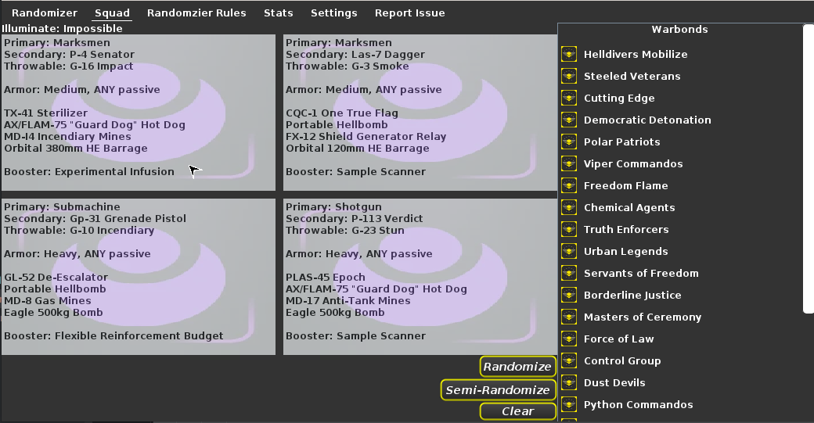

[Download](https://github.com/user-attachments/files/25459824/HDApp.zip)

# Get ready to spread democracy with the Helldivers 2 Randomizer App

* Can select which warbonds are in the randomizer
* Can have a fully random or semi-random loadout
* Can get random extra challenges
* Changes the background based on the enemy
* Recreated the HD2 themeing
* Democracy calls with each assignment!
* Saves your warbond selection when closing the app
* Keyboard shortcuts (f10 for random, f11 for semi, - for lose, = for win)
* Only 9.4Mb

# Play With Your Friends

Generate a whole randomizer for your squad

# See Your Preformance

 
* Prove to your Democracy officer and friends how well you deliver democracy
* Stats page has a uniqueue page for the fully random and semi random pages

# Configure Your Settings

* Customizable settings
